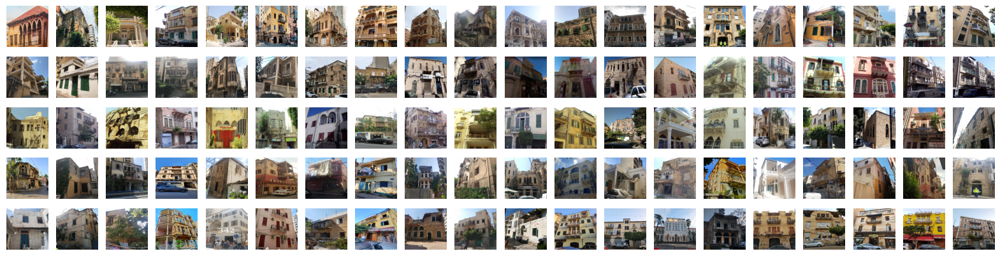

# Beirut Construction Period Classifier 



-blue)

## Introduction
This repository contains the code for the thesis project "Characterization of the Construction Period of Buildings in Beirut from Street-View Photos Using Deep Learning".
######
This work was part of my Master's thesis project at the American University of Beirut (AUB).
The project aimed to predict the construction period of buildings in Beirut using street-view images.
The project was supervised by Prof. Mayssa Dabaghi, Prof. Sirine Taleb, and Prof. Aram Yeretzian.
######
The repository contains the code for the following tasks:
1. Data Preprocessing 
2. Model Training with Transfer Learning
3. Model Optimization (Hyperparameter Tuning)
4. Model Prediction and Evaluation
5. Model Interpretation (LIME)
6. Model Deployment
7. Web Application
8. Dockerization
9. Automated Data Collection
######
The repository also contains the trained models and part of the dataset used in the project. The full dataset is not included in the repository due to copyright issues.
## Construction Periods
The model is trained to predict the construction periods that are divided into the following categories:

| Construction Period | Architectural Theme |
|---------------------|---------------------|
| Pre-1935            | Old Beirut          |
| 1935-1955           | Early Modern        |
| 1956-1971           | Late Modern         |
| 1972-1990           | Post-Modern         |
| Post-1990           | Contemporary        |

## Model Architecture
The model architecture
used in the project is a pre-trained [SwinT model](https://arxiv.org/abs/2103.14030) with a custom head fine-tuned on the dataset.

## Installation
First, clone the repository using the following command:
```bash
git clone https://github.com/davidwardan/BeirutCP_Classifier.git
```
Then, create and activate your conda environment using the following commands (refer to the miniconda documentation https://docs.anaconda.com/free/miniconda/miniconda-install/):
```bash
conda create -n Beirut_env python=3.10
conda activate Beirut_env
```
Finally, install the required packages using the following command:
```bash
cd BeirutCP_Classifier
pip install -r requirements.txt
```
Remember to replace the path to the repository with the correct path on your machine.

## Classifier Gradio Interface
To run the classifier UI feature, use the following command:
```bash
python -m Classification_UI
```

## Todo:
The following tasks are planned to be implemented in the future:

- [x] Data Preprocessing
- [x] Model Training with Transfer Learning
- [ ] Model Optimization (Hyperparameter Tuning)
- [x] Model Prediction and Evaluation
- [x] Model Interpretation (LIME)
- [x] Model Interpretation (SHAP)
- [x] Gradio Interface
- [ ] Dockerization
- [ ] Documentation
- [ ] Automated Data Collection
- [ ] Ability to provide additional information about the building
- [ ] Ability to recognize if the building is not from Beirut
- [ ] Ability to recognize if the building is not a building

## License
This project is licensed under the MIT License—see the `LICENSE` file for details.
